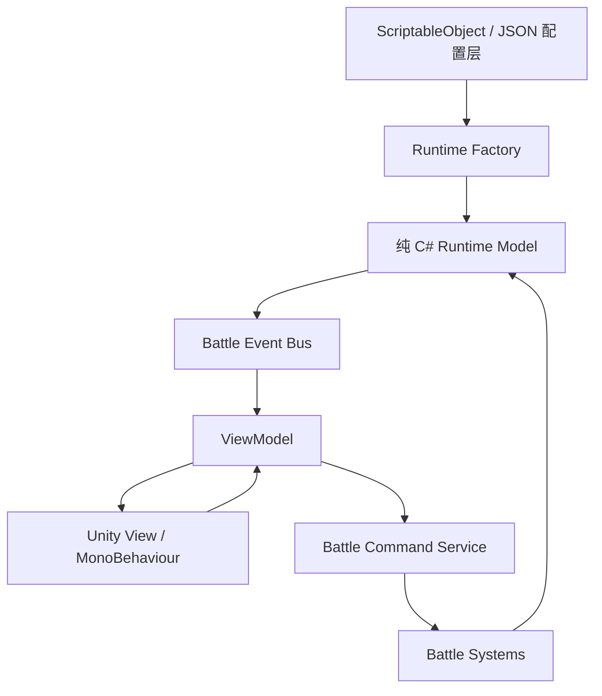
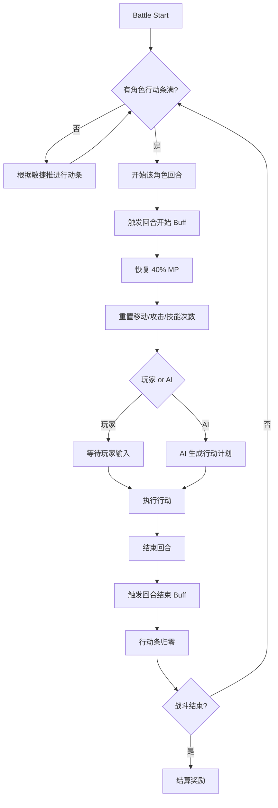
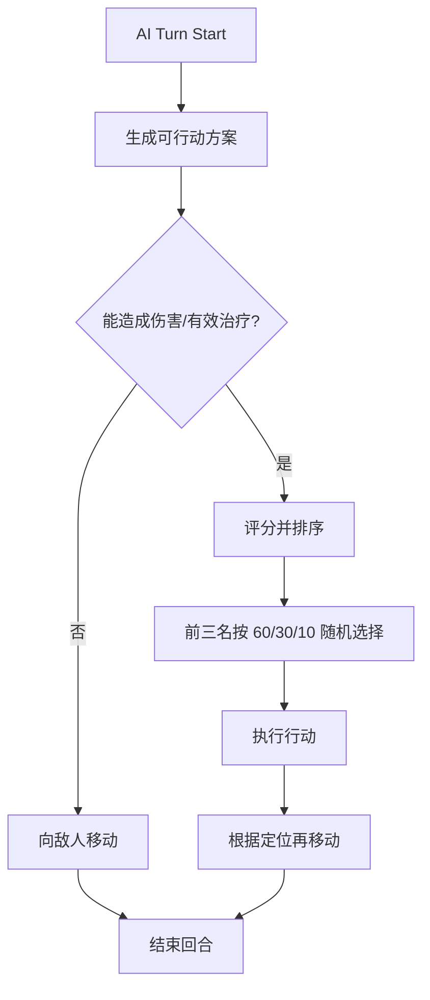
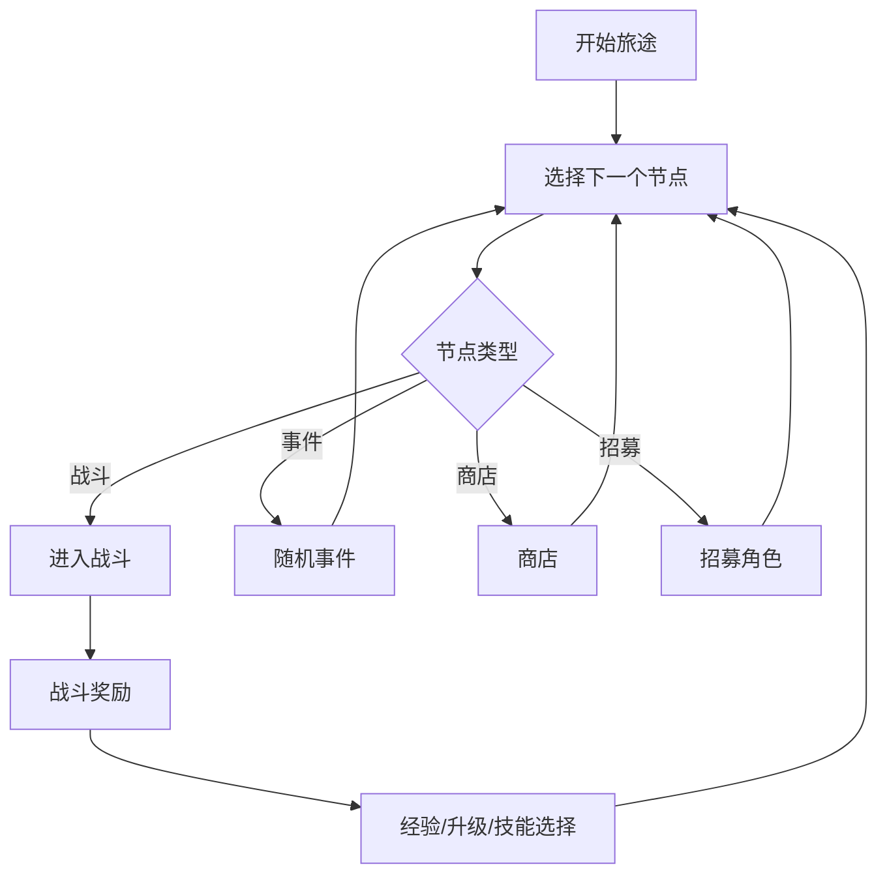

# 类“喵喵的结合”的 Roguelike 战棋游戏架构设计

## 0. 核心设计思路

本项目可以理解为：

> **旅途养成 + 行动条战棋 + 可扩展技能/Buff系统 + MVVM UI 架构**

架构核心原则：

**Model 保存纯游戏状态，System 负责规则计算，ViewModel 负责把状态变成 UI 可绑定数据，View 只负责显示和输入。**

技能和 Buff 不应该写成大量 `if skillId == xxx`，而应该设计成：

- 技能 = 施法范围 + 影响范围 + 多个 Effect
- Buff = 生命周期 + 多个 BuffComponent
- AI = 生成 Command，不直接修改 Model
- ViewModel = 调用 Command，不写战斗规则
- ScriptableObject / JSON = 静态配置
- Runtime Model = 战斗中的真实运行时状态

---

## 1. 总体架构



推荐目录结构：

```text
Game
├── Core
│   ├── Observable
│   ├── EventBus
│   ├── Command
│   └── Result
│
├── Data
│   ├── CharacterDef
│   ├── SkillDef
│   ├── BuffDef
│   ├── EnemyDef
│   ├── AIPlanDef
│   └── GrowthDef
│
├── Runtime
│   ├── CharacterModel
│   ├── StatSet
│   ├── SkillInstance
│   ├── BuffInstance
│   ├── BattleState
│   └── RunState
│
├── Battle
│   ├── BattleController
│   ├── BattleLoopSystem
│   ├── ActionGaugeSystem
│   ├── MovementSystem
│   ├── CombatSystem
│   ├── SkillSystem
│   ├── BuffSystem
│   ├── TargetingSystem
│   ├── DeathSystem
│   ├── AI
│   └── RewardSystem
│
├── MetaRun
│   ├── TravelMapSystem
│   ├── RecruitmentSystem
│   ├── LevelUpSystem
│   └── EventSystem
│
├── UI
│   ├── ViewModels
│   ├── Views
│   └── Binding
│
└── Save
    ├── SaveData
    ├── SaveService
    └── RunSaveService
```

---

## 2. MVVM 职责拆分

### 2.1 Model：纯数据 + 纯状态

`CharacterModel` 不继承 `MonoBehaviour`，也不直接操作 UI。

```csharp
public class CharacterModel
{
    public string InstanceId;
    public string CharacterDefId;

    public TeamType Team;
    public GridPosition Position;

    public StatSet Stats;

    public int CurrentHp;
    public int CurrentMp;

    public int Level;
    public int Exp;

    public int ActionGauge;
    public bool IsDead;
    public bool IsActivated; // 敌人警戒后激活

    public List<SkillInstance> Skills = new();
    public List<BuffInstance> Buffs = new();

    public TurnActionState TurnState = new();
}
```

`TurnActionState` 用于记录当前回合资源。

```csharp
public class TurnActionState
{
    public int RemainingMove;
    public bool HasUsedBasicAttack;
    public Dictionary<string, int> SkillUseCountThisTurn = new();

    public void Reset(CharacterModel character)
    {
        RemainingMove = character.Stats.GetFinalInt(StatId.MoveRange);
        HasUsedBasicAttack = false;
        SkillUseCountThisTurn.Clear();
    }
}
```

---

### 2.2 System：真正的游戏逻辑

主要系统包括：

```text
CombatSystem       普攻、命中、闪避、暴击、伤害结算
SkillSystem        技能施放、MP、冷却、次数限制、效果执行
BuffSystem         Buff 添加、移除、触发、持续时间
MovementSystem     移动范围、路径、消耗移动力
ActionGaugeSystem  行动条积累
AISystem           AI 决策
LevelUpSystem      经验、升级、技能三选一
```

攻击函数不要写在 ViewModel 里。

ViewModel 只应该调用：

```csharp
battleCommandService.TryExecute(new BasicAttackCommand(actorId, targetId));
```

然后由 `BattleCommandService` 验证并调用 `CombatSystem`。

---

### 2.3 ViewModel：UI 状态适配器

```csharp
public class CharacterViewModel : ViewModelBase
{
    private readonly CharacterModel model;

    public string Name => model.CharacterDefId;
    public int Hp => model.CurrentHp;
    public int MaxHp => model.Stats.GetFinalInt(StatId.MaxHp);
    public int Mp => model.CurrentMp;
    public int MaxMp => model.Stats.GetFinalInt(StatId.MaxMp);

    public bool IsDead => model.IsDead;
    public IReadOnlyList<SkillButtonViewModel> Skills { get; }

    public void Refresh()
    {
        OnPropertyChanged(nameof(Hp));
        OnPropertyChanged(nameof(Mp));
        OnPropertyChanged(nameof(IsDead));
    }
}
```

一个 `CharacterModel` 可以对应多个 ViewModel：

```text
CharacterModel
├── BattleUnitViewModel      战场棋子显示
├── CharacterPanelViewModel  左侧角色详情面板
├── TurnOrderViewModel       行动条 UI
└── SkillBarViewModel        技能栏 UI
```

这是合理的。Model 是数据源，不同 UI 需要不同 ViewModel 视角。

---

### 2.4 View：Unity 显示层

View 只做三件事：

```text
1. 监听 ViewModel 的 PropertyChanged
2. 更新 Text / Image / Slider / Animator
3. 把玩家点击、拖拽、选择格子等输入传给 ViewModel
```

示例：

```csharp
public class CharacterPanelView : MonoBehaviour
{
    [SerializeField] private Slider hpSlider;
    [SerializeField] private TMP_Text hpText;

    private CharacterViewModel vm;

    public void Bind(CharacterViewModel viewModel)
    {
        vm = viewModel;
        vm.PropertyChanged += OnViewModelChanged;
        RefreshAll();
    }

    private void OnViewModelChanged(object sender, PropertyChangedEventArgs e)
    {
        if (e.PropertyName == nameof(vm.Hp))
        {
            RefreshHp();
        }
    }

    private void RefreshHp()
    {
        hpSlider.value = (float)vm.Hp / vm.MaxHp;
        hpText.text = $"{vm.Hp}/{vm.MaxHp}";
    }
}
```

---

## 3. 战斗核心流程

行动条机制推荐流程：



行动条不要每帧一点点加，推荐用数学推进。

```csharp
public void AdvanceUntilSomeoneReady(BattleState state)
{
    int threshold = state.ActionGaugeThreshold;

    float minTime = float.MaxValue;

    foreach (var c in state.GetAliveActivatedCharacters())
    {
        int agility = c.Stats.GetFinalInt(StatId.Agility);
        if (agility <= 0) continue;

        float timeToReady = (threshold - c.ActionGauge) / (float)agility;
        minTime = Math.Min(minTime, timeToReady);
    }

    foreach (var c in state.GetAliveActivatedCharacters())
    {
        int agility = c.Stats.GetFinalInt(StatId.Agility);
        c.ActionGauge += Mathf.CeilToInt(agility * minTime);
    }
}
```

这样可以避免大量无意义 tick。

如果多个角色同时满行动条，建议使用稳定规则：

```text
1. 行动条超出最多者优先
2. 敏捷高者优先
3. 队伍优先级
4. InstanceId 作为最终稳定排序
```

---

## 4. 属性系统设计

角色基础属性：

```csharp
public enum StatId
{
    MaxHp,
    MaxMp,
    Strength,
    Agility,
    SpellPower,
    Luck,
    MoveRange,
    AttackRange
}
```

`AttackType` 不建议放进数值 Stat，应该单独做 enum。

```csharp
public enum AttackType
{
    Melee,
    Ranged
}
```

角色中保存：

```csharp
public AttackType BasicAttackType;
```

原因是 `AttackType` 不是可加减的数值。把它放进 `StatSet` 会让 Modifier 系统变复杂。

---

### 4.1 StatSet

```csharp
public class StatSet
{
    private readonly Dictionary<StatId, Stat> stats = new();

    public int GetFinalInt(StatId id)
    {
        return stats[id].FinalValue;
    }

    public void AddModifier(StatModifier modifier)
    {
        stats[modifier.StatId].AddModifier(modifier);
    }

    public void RemoveModifiersFromSource(string sourceId)
    {
        foreach (var stat in stats.Values)
        {
            stat.RemoveModifiersFromSource(sourceId);
        }
    }
}
```

每个 `Stat` 推荐支持：

```text
BaseValue        基础值
FlatModifier     固定加减
PercentModifier  百分比加减
Override         特殊覆盖，少用
FinalValue       最终值
```

Buff 结束时不要手动猜要删哪个数值，应该按 `sourceId` 删除。

```csharp
public class StatModifier
{
    public string SourceId; // buff instance id
    public StatId StatId;
    public ModifierType Type;
    public int Value;
}
```

Buff 过期：

```csharp
character.Stats.RemoveModifiersFromSource(buff.InstanceId);
```

这样一个 Buff 产生多个属性修改也可以一次性清干净。

---

## 5. 普通攻击系统

普通攻击可以看作一个特殊 Skill，但早期建议单独实现，后期再统一进 Skill 系统。

```text
BasicAttack
├── 检查是否已经攻击过
├── 检查距离
├── 检查近战/远程范围规则
├── 命中/闪避
├── 暴击
├── 伤害结算
└── 标记 HasUsedBasicAttack = true
```

近战规则：

```text
近战：
- 不能攻击斜角
- 使用 100% Strength

远程：
- 可以攻击斜角
- 使用 70% Strength
```

可以抽象成：

```csharp
public interface IBasicAttackRangeRule
{
    bool IsTargetInRange(CharacterModel attacker, CharacterModel target, GridMap map);
}

public interface IBasicAttackDamageFormula
{
    int CalculateDamage(CharacterModel attacker, CharacterModel target);
}
```

---

## 6. 技能系统设计

技能系统建议使用：

```text
SkillDef        静态配置
SkillInstance   运行时状态
SkillEffect     技能效果组件
RangePattern    施法范围组件
AreaPattern     影响范围组件
```

---

### 6.1 SkillDef

```csharp
[CreateAssetMenu]
public class SkillDef : ScriptableObject
{
    public string Id;
    public string DisplayName;
    public int MaxLevel;

    public int MpCost;
    public int CooldownTurns;
    public int MaxUsePerTurn; // 0 表示无限

    public TargetTeamType TargetTeam;
    public RangePattern RangePattern;
    public AreaPattern AreaPattern;

    public List<SkillEffectDef> Effects;
}
```

---

### 6.2 SkillInstance

```csharp
public class SkillInstance
{
    public string SkillDefId;
    public int Level;

    public int CooldownRemaining;
    public int UsesThisTurn;
}
```

---

### 6.3 SkillEffect

技能效果不要写死在 `SkillSystem` 里。

推荐接口：

```csharp
public interface ISkillEffect
{
    bool CanApply(SkillContext context, TargetSet targets);
    EffectPreview Preview(SkillContext context, TargetSet targets);
    void Apply(SkillContext context, TargetSet targets);
}
```

常见效果：

```text
DamageEffect
HealEffect
ApplyBuffEffect
ReviveEffect
MoveEffect
CleanseBuffEffect
DispelBuffEffect
SummonEffect
AddShieldEffect
ModifyActionGaugeEffect
```

一个技能可以有多个效果：

```text
火焰斩 Lv.2
├── DamageEffect：力量 120%
├── DamageEffect：法强 50%
└── ApplyBuffEffect：灼烧 2 回合
```

治疗复活技能：

```text
圣光术
├── HealEffect：法强 150%
└── ReviveEffect：如果目标死亡，则复活并恢复 30% MaxHp
```

---

## 7. 施法范围系统

技能需要“可编程施法范围”，建议抽象成 `RangePattern`。

```csharp
public abstract class RangePattern : ScriptableObject
{
    public abstract List<GridPosition> GetValidCells(
        CharacterModel caster,
        BattleState battleState,
        int skillLevel
    );
}
```

常见 RangePattern：

```text
SelfRangePattern
MeleeCrossRangePattern
DiamondRangePattern
SquareRangePattern
LineRangePattern
ConeRangePattern
GlobalRangePattern
CustomScriptedRangePattern
```

菱形范围示例：

```text
曼哈顿距离 <= range
```

```csharp
public class DiamondRangePattern : RangePattern
{
    public int BaseRange;

    public override List<GridPosition> GetValidCells(
        CharacterModel caster,
        BattleState battleState,
        int skillLevel)
    {
        int range = BaseRange + skillLevel - 1;
        var result = new List<GridPosition>();

        foreach (var cell in battleState.Grid.AllCells)
        {
            int distance = GridDistance.Manhattan(caster.Position, cell);
            if (distance <= range)
                result.Add(cell);
        }

        return result;
    }
}
```

影响范围也单独做：

```csharp
public abstract class AreaPattern : ScriptableObject
{
    public abstract List<GridPosition> GetAffectedCells(
        GridPosition selectedCell,
        CharacterModel caster,
        BattleState battleState,
        int skillLevel
    );
}
```

这样可以支持：

```text
单体技能
十字范围
九宫格范围
直线穿透
锥形范围
以自己为中心的环形范围
随机多个目标
```

---

## 8. Buff 系统设计

Buff 是这个游戏最需要提前设计好的模块。

推荐结构：

```text
BuffDef
├── Duration
├── StackRule
├── TickTiming
└── BuffComponents[]

BuffInstance
├── BuffDefId
├── SourceCharacterId
├── TargetCharacterId
├── RemainingTurns
├── StackCount
└── RuntimeData
```

---

### 8.1 BuffComponent

不要让 BuffSystem 知道所有 Buff 类型。

使用 Hook 接口：

```csharp
public interface IBuffComponent
{
}

public interface IOnTurnStart
{
    void OnTurnStart(BuffContext context);
}

public interface IOnTurnEnd
{
    void OnTurnEnd(BuffContext context);
}

public interface IStatModifierProvider
{
    IEnumerable<StatModifier> GetModifiers(BuffContext context);
}

public interface IBeforeDamageDealt
{
    void BeforeDamageDealt(DamageContext context);
}

public interface IBeforeDamageTaken
{
    void BeforeDamageTaken(DamageContext context);
}

public interface IAfterSkillCast
{
    void AfterSkillCast(SkillContext context);
}

public interface IModifySkillEffect
{
    void ModifySkillEffect(SkillContext context);
}
```

这样未来要加新 Buff，不需要改 `BuffSystem` 主体。

---

### 8.2 常见 Buff 类型

```text
属性 Buff
- 力量 +20%
- 敏捷 -10
- 移动力 +1

延迟伤害 / 治疗
- 2 回合后造成法强 200% 伤害
- 1 回合后恢复 30% MaxHp

持续伤害 / 治疗
- 每回合开始受到 10 点伤害
- 每回合结束恢复法强 50% 生命

技能增强
- 下次火系技能伤害 +50%
- 普通攻击附带中毒
- 治疗技能额外增加护盾

行动类 Buff
- 禁止移动
- 禁止普通攻击
- 技能 MP 消耗增加
- 行动条积累速度下降
```

---

### 8.3 伤害 / 治疗统一成 Effect

三种伤害类型：

```text
1. 直接伤害
2. 几回合后触发
3. 多回合持续
```

可以这样实现：

```text
直接伤害：
SkillEffect -> DamageEffect -> 立即结算

几回合后触发：
SkillEffect -> ApplyBuffEffect -> DelayedDamageBuffComponent

多回合持续：
SkillEffect -> ApplyBuffEffect -> PeriodicDamageBuffComponent
```

治疗同理：

```text
直接治疗：
HealEffect

延迟治疗：
DelayedHealBuffComponent

持续治疗：
PeriodicHealBuffComponent
```

这样 Damage 和 Heal 不需要两套完全不同的系统。

---

## 9. 死亡与复活

建议不要把死亡角色立刻从列表删除，而是：

```csharp
character.IsDead = true;
character.CurrentHp = 0;
```

死亡后：

```text
不能行动
不能被普通治疗选中
可以被 ReviveEffect 选中
行动条暂停
Buff 是否保留由规则决定
```

复活示例：

```csharp
public class ReviveEffect : ISkillEffect
{
    public void Apply(SkillContext context, TargetSet targets)
    {
        foreach (var target in targets.Characters)
        {
            if (!target.IsDead) continue;

            target.IsDead = false;
            target.CurrentHp = CalculateReviveHp(context, target);

            context.EventBus.Publish(new CharacterRevivedEvent(target.InstanceId));
        }
    }
}
```

建议每个治疗技能配置：

```csharp
public bool CanTargetDeadAlly;
```

而不是让所有治疗都能复活。

---

## 10. AI 系统设计

AI 不应该直接控制 `CharacterModel`，而是生成和玩家一样的 Command。

```csharp
public interface IActorController
{
    BattleActionPlan DecideAction(CharacterModel actor, BattleState state);
}
```

实现三种：

```text
PlayerActorController
ProgrammedAIController
AutoAIController
```

---

### 10.1 可编程 AI

策划可以配置：

```text
第 1 回合：移动到指定区域，释放技能 A
第 2 回合：如果血量低于 50%，释放治疗；否则自动 AI
第 3 回合：释放大招
之后：自动 AI
```

结构：

```csharp
public class AIPlanDef : ScriptableObject
{
    public List<AIRoundPlan> RoundPlans;
    public bool FallbackToAutoAI;
}
```

每个步骤：

```text
MoveToCellStep
CastSkillStep
BasicAttackStep
WaitStep
SwitchToAutoAIStep
ConditionalStep
```

---

### 10.2 自动 AI

自动 AI 的规则可以拆成三步：

```text
1. 枚举当前角色本回合可能行动
2. 对行动评分
3. 取分数前三，以 60% / 30% / 10% 选择
```

`BattleActionPlan`：

```csharp
public class BattleActionPlan
{
    public List<IBattleCommand> Commands = new();
    public int Score;
}
```

评分可以先简单设计：

```text
Score =
  有效伤害 * 100
+ 有效治疗 * 80
+ 击杀奖励 * 500
+ 复活奖励 * 600
+ 给重要目标上 Debuff 奖励
+ 自己远离敌人的安全分
- 受到反击/危险区域惩罚
```

有效治疗要避免奶满血角色刷分：

```text
EffectiveHeal = min(HealAmount, TargetMaxHp - TargetCurrentHp)
```

---

### 10.3 自动 AI 行动流程



近战 / 远程行动结束后：

```text
近战：
- 尽量贴近敌人
- 或保持当前位置

远程：
- 在能打到敌人的前提下，尽可能远离敌方威胁范围
```

---

## 11. 警戒距离与敌人激活

敌人多一个属性：

```csharp
public int AlertRange;
public bool IsActivated;
```

激活条件：

```text
1. 敌人受到攻击
2. 友方 / 支援角色进入警戒范围
```

推荐系统：

```csharp
public class EnemyActivationSystem
{
    public void CheckActivation(BattleState state)
    {
        foreach (var enemy in state.Enemies)
        {
            if (enemy.IsActivated || enemy.IsDead) continue;

            if (WasAttacked(enemy) || HasPlayerInAlertRange(enemy, state))
            {
                enemy.IsActivated = true;
                state.EventBus.Publish(new EnemyActivatedEvent(enemy.InstanceId));
            }
        }
    }
}
```

未激活敌人建议：

```text
不积累行动条
不参与 AI 行动
可以被攻击
受到攻击后激活
```

这样规则最清晰。

---

## 12. 指令系统 Command Pattern

玩家和 AI 都只产生 Command。

```csharp
public interface IBattleCommand
{
    CommandResult Validate(BattleState state);
    void Execute(BattleState state);
}
```

常见 Command：

```text
MoveCommand
BasicAttackCommand
CastSkillCommand
EndTurnCommand
WaitCommand
```

好处：

```text
1. 玩家和 AI 共用同一套规则
2. 方便做撤销 / 预览 / 回放
3. 方便写测试
4. ViewModel 不需要知道具体战斗细节
```

示例：

```csharp
public class CastSkillCommand : IBattleCommand
{
    public string CasterId;
    public string SkillInstanceId;
    public GridPosition TargetCell;

    public CommandResult Validate(BattleState state)
    {
        // 检查是否轮到该角色
        // 检查 MP
        // 检查冷却
        // 检查每回合次数
        // 检查目标是否合法
        return CommandResult.Success();
    }

    public void Execute(BattleState state)
    {
        state.SkillSystem.CastSkill(CasterId, SkillInstanceId, TargetCell);
    }
}
```

---

## 13. 局内成长与技能三选一

角色配置：

```csharp
[CreateAssetMenu]
public class CharacterDef : ScriptableObject
{
    public string Id;
    public string DisplayName;

    public BaseStatBlock BaseStats;
    public GrowthDef Growth;

    public AttackType BasicAttackType;

    public List<SkillPoolEntry> SkillPool;
}
```

技能池：

```csharp
public class SkillPoolEntry
{
    public string SkillDefId;
    public int Weight;
    public int MinLevel;
    public int MaxLevel;
}
```

升级流程：

```text
1. 增加基础属性
2. 从角色 SkillPool 抽 3 个选项
3. 如果角色已经拥有该技能，则生成“升级该技能”
4. 如果角色没有该技能且技能槽未满，则生成“学习新技能”
5. 如果技能槽已满，可以只抽已有技能升级，或者允许替换技能
```

建议先采用：

```text
技能未满：可以抽到新技能或已有技能升级
技能已满：只抽已有技能升级
```

这样最简单，不需要设计替换 UI。

升级选项：

```csharp
public abstract class LevelUpChoice
{
    public string DisplayName;
    public abstract void Apply(CharacterModel character);
}

public class LearnSkillChoice : LevelUpChoice
{
    public string SkillDefId;
}

public class UpgradeSkillChoice : LevelUpChoice
{
    public string SkillInstanceId;
}
```

---

## 14. Roguelike 旅途模块

战斗外推荐这样拆：

```text
RunState
├── 当前队伍
├── 当前地图节点
├── 已访问节点
├── 当前金币/资源
├── 当前事件状态
└── 随机种子
```

旅途流程：



---

## 15. BattleState 设计

战斗中所有运行时状态集中在 `BattleState`。

```csharp
public class BattleState
{
    public GridMap Grid;
    public List<CharacterModel> Characters;

    public string CurrentActorId;
    public int TurnIndex;
    public int ActionGaugeThreshold = 1000;

    public BattlePhase Phase;

    public BattleEventBus EventBus;

    public IEnumerable<CharacterModel> AliveCharacters =>
        Characters.Where(c => !c.IsDead);

    public IEnumerable<CharacterModel> GetAliveActivatedCharacters()
    {
        return Characters.Where(c =>
            !c.IsDead &&
            (c.Team != TeamType.Enemy || c.IsActivated)
        );
    }
}
```

`BattlePhase`：

```csharp
public enum BattlePhase
{
    Init,
    WaitingForGauge,
    TurnStart,
    WaitingForPlayerInput,
    ExecutingAI,
    ResolvingAction,
    TurnEnd,
    BattleEnd
}
```

---

## 16. 事件系统

系统之间不要互相强耦合。

例如 `CombatSystem` 造成伤害后发布事件：

```csharp
public record CharacterDamagedEvent(
    string SourceId,
    string TargetId,
    int Amount,
    DamageType DamageType
);
```

常见事件：

```text
TurnStartedEvent
TurnEndedEvent
CharacterMovedEvent
CharacterDamagedEvent
CharacterHealedEvent
CharacterDiedEvent
CharacterRevivedEvent
BuffAppliedEvent
BuffExpiredEvent
SkillCastEvent
EnemyActivatedEvent
LevelUpEvent
BattleEndedEvent
```

ViewModel 监听这些事件并刷新 UI。

BuffSystem 也可以监听事件，例如：

```text
受到攻击后触发反伤
施放技能后获得护盾
击杀敌人后恢复 MP
```

---

## 17. 推荐开发顺序

不要一开始就做完整 Roguelike。建议按这个顺序：

```text
第一阶段：纯战斗核心
1. CharacterModel / StatSet
2. GridMap / MovementSystem
3. ActionGaugeSystem
4. BasicAttack / Damage / Death
5. BattleLoop

第二阶段：技能和 Buff
6. SkillDef / SkillInstance
7. RangePattern / AreaPattern
8. DamageEffect / HealEffect / ApplyBuffEffect
9. BuffSystem / BuffComponent

第三阶段：AI
10. EnemyActivationSystem
11. AutoAIController
12. ProgrammedAIController

第四阶段：成长和旅途
13. Exp / LevelUp / SkillChoice
14. Recruit / RunState
15. TravelMap

第五阶段：MVVM UI
16. BattleViewModel
17. CharacterPanelViewModel
18. SkillBarViewModel
19. GridCellViewModel
20. TurnOrderViewModel
```

---

## 18. 最关键的设计原则

这个项目最容易失控的地方是：

```text
1. 技能
2. Buff
3. AI
4. UI 和战斗逻辑耦合
```

所以一开始就要坚持：

```text
1. 技能 = Range + TargetFilter + 多个 Effect
2. Buff = 多个 BuffComponent + 生命周期
3. AI = 生成 Command，不直接改 Model
4. ViewModel = 调用 Command，不写战斗逻辑
5. Model = 纯 C#，不依赖 Unity UI
6. ScriptableObject = 静态配置，不保存运行时状态
7. SaveData = 保存 id 和运行时数值，不直接保存 ScriptableObject
```

推荐最核心的数据流：

```text
玩家点击 UI
→ View 调用 ViewModel
→ ViewModel 创建 Command
→ BattleCommandService 验证 Command
→ System 修改 Model
→ Model / System 发布 Event
→ ViewModel 刷新属性
→ View 更新画面
```

---

## 19. 总结

这套架构的目标是让项目可以长期扩展。

当未来你新增一个技能时，理想流程应该是：

```text
1. 新建 SkillDef
2. 选择 RangePattern
3. 选择 AreaPattern
4. 添加多个 SkillEffect
5. 配进角色 SkillPool
```

不应该需要改 `CombatSystem` 或 `BattleLoopSystem`。

当未来你新增一个 Buff 时，理想流程应该是：

```text
1. 新建 BuffDef
2. 添加一个或多个 BuffComponent
3. 配置持续时间、叠加规则、触发时机
```

不应该需要在 `BuffSystem` 里写大量特殊判断。

最终目标是：

> **策划通过配置组合出大部分技能和 Buff，程序只在出现全新机制时扩展新的 Effect 或 BuffComponent。**
